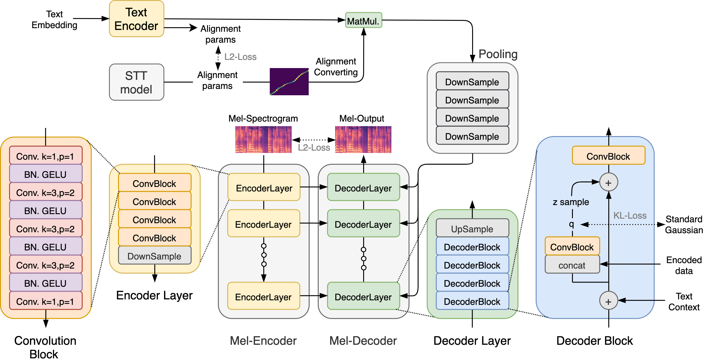

# 
 KimchiSpeech: Faster, Lighter and More Controllable TTS with Hierachical VAE and STT-aided Gaussian Attention 

# Abstract
In this study, we propose a text-to-speech (TTS) model, referred to as KimchiSpeech, which has a hierarchical variational autoencoder (VAE) structure and uses a attention alignment obtained from a speech-to-text (STT) model. The hierarchical VAE structure contributes to the generation of high-quality outputs and a variety of prosody. Because the STT model operates independently of the TTS model, the attention alignment can be obtained robustly. Moreover, the speed of a generated
speech can be flexibly controlled by soft attention using Gaussian distributions. Furthermore, we propose two configurations of the model, namely KimchiSpeech-W and KimchiSpeech-S. The former is a light version that has only 3.3M parameters for inference, whereas the latter is a fast version that produces outputs 470 times faster than real time on a GPU. The mean opinion score (MOS) results show that the outputs are of state-of-the-art quality.
<audio src="wavs/kimchispeech_abstract.wav" controls preload></audio>

# Requirement

pytorch==1.8.1 
librosa==0.8.0 
numpy==1.19.1 
g2p-en==2.1.0 
matplotlib==3.1.0 
parallel-wavegan==0.4.8

# Training

1. Download and extract [LJSpeech-1.1](https://keithito.com/LJ-Speech-Dataset/).
2. Modify data_dir in hparams/hparams_W4G.py or hparams/hparams_S5G.py.
3. Run train_W4G.ipynb or train_S5G.ipynb

# Inference

run inference_W4G.ipynb or inference_S4G.ipynb

# Reference

https://github.com/NVIDIA/tacotron2
https://github.com/openai/vdvae
